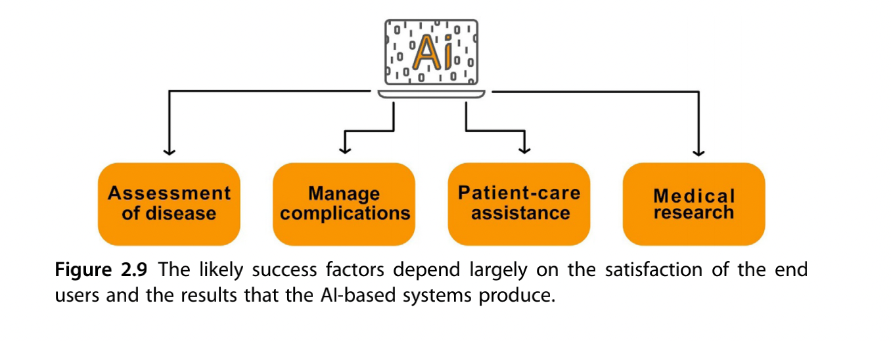

# The rise of artificial intelligence in healthcare applications

Los macrodatos y el aprendizaje automático están influyendo en la mayoría de los aspectos de la vida moderna, desde el entretenimiento hasta el comercio y la sanidad. de la vida moderna, desde el entretenimiento hasta el comercio y la atención sanitaria. Netflix sabe qué películas y series prefiere ver la gente, Amazon conoce qué artículos le gusta comprar a la gente, cuándo y dónde, y Google sabe qué síntomas y afecciones busca la gente. Todos estos datos pueden perfiles personales muy detallados, que pueden ser muy valiosos para para comprender y orientar el comportamiento, pero también tiene potencial para predecir tendencias sanitarias. Existe un gran optimismo en que la aplicación de de la inteligencia artificial (IA) pueda aportar mejoras sustanciales
de la asistencia sanitaria, desde el diagnóstico hasta el tratamiento. Ya hay numerosas pruebas de que los algoritmos de IA rinden igual o mejor que los humanos en diversas tareas. que los humanos en diversas tareas, por ejemplo, en el análisis de imágenes médicas o la correlacionar síntomas y biomarcadores de historias clínicas electrónicas (EMR) con la caracterización y el pronóstico de la enfermedad [1].

La demanda de servicios sanitarios es cada vez mayor y en muchos países escasean los profesionales de la salud, especialmente los médicos. Las instituciones sanitarias también luchan por mantenerse al día con todos los los nuevos avances tecnológicos y las altas expectativas de los pacientes con respecto a los niveles de servicio y los resultados que conocen de los productos de consumo, incluidos los de Amazon y Apple [2]. Los avances de la tecnología inalámbrica y los teléfonos inteligentes han servicios sanitarios a la carta mediante aplicaciones de seguimiento de la salud y plataformas de búsqueda, y también han permitido una nueva forma de prestación de asistencia sanitaria, a través de interacciones a distancia, disponibles en cualquier momento y lugar. interacciones a distancia, disponibles en cualquier momento y lugar. Estos servicios son importantes para regiones desatendidas y lugares que carecen de especialistas y ayudan a reducir costes y evitar la exposición innecesaria a enfermedades contagiosas en la clínica.

La tecnología de telesalud también es relevante en los países en desarrollo, donde el sistema sanitario se está expandiendo y donde la infraestructura sanitaria puede diseñarse para satisfacer las necesidades actuales [3]. Aunque el concepto está claro, estas
soluciones aún necesitan una validación independiente sustancial para demostrar la seguridad y eficacia para el paciente.

El ecosistema sanitario se está dando cuenta de la importancia de las herramientas impulsadas por IA en la tecnología sanitaria de nueva generación. Se cree que la IA puede aportar mejoras a cualquier proceso dentro del funcionamiento y la prestación de la asistencia sanitaria. Por ejemplo, el ahorro de costes que la IA puede suponer para el sistema sanitario es un motor importante para la implantación de aplicaciones de IA. Se calcula que las aplicaciones de IA pueden reducir los costes sanitarios anuales en EE.UU. en 150.000 millones de dólares en 2026. Gran parte de estas reducciones de costes se derivan del cambio del modelo sanitario de un enfoque reactivo a uno proactivo, centrado en la gestión de la salud más que en el tratamiento de la enfermedad. Se espera que esto se traduzca en menos hospitalizaciones, menos visitas al médico y menos tratamientos. La tecnología basada en la IA desempeñará un papel importante a la hora de ayudar a las personas a mantenerse sanas a través de la monitorización y el asesoramiento continuos, y garantizará un diagnóstico más precoz, tratamientos personalizados y seguimientos más eficientes.

Se espera que el mercado de la asistencia sanitaria asociada a la IA crezca rápidamente y alcance los 6 600 millones de USD en 2021, lo que corresponde a una tasa de crecimiento anual compuesto del 40 %.
anual compuesta

## Technological advancements

En la última década se han producido numerosos avances tecnológicos en el campo de la IA y la ciencia de datos. Aunque la investigación en IA para diversas aplicaciones lleva varias décadas en marcha, la actual oleada de auge de la IA es diferente de las anteriores. Una combinación perfecta de mayor velocidad de procesamiento informático, mayores bibliotecas de datos bibliotecas de datos y una gran reserva de talentos en IA ha permitido el rápido desarrollo de también en el ámbito sanitario [5]. Esto va a suponer un cambio de paradigma en el nivel de la tecnología de IA y su adopción e impacto en la sociedad. En particular, el desarrollo del aprendizaje profundo (AD) ha tenido un impacto en la forma en que vemos hoy las herramientas de IA y es la razón de gran parte del reciente entusiasmo en torno a las aplicaciones de la IA. DL permite encontrar correlaciones que eran demasiado complejas de obtener con los anteriores algoritmos de aprendizaje anteriores. Se basa en gran medida en las redes neuronales artificiales y en comparación con las redes neuronales anteriores, que sólo tenían 35 capas de conexiones, las redes DL tienen más de 10 capas. Esto corresponde a simulación de neuronas artificiales del orden de millones. Hay numerosas empresas punteras en este campo, entre ellas IBM Watson y Deep Mind de Google. Estas empresas han demostrado que su IA puede vencer a los humanos en determinadas tareas y actividades como el ajedrez, el Go y otros juegos. Tanto IBM Watson como Deep Mind de Google se utilizan actualmente para muchas aplicaciones relacionadas con la atención sanitaria. IBM Watson se está utilizando para investigar la gestión de la diabetes, la atención y el modelado avanzados del cáncer y el descubrimiento de fármacos, pero aún no ha demostrado su valor clínico para los pacientes. mostrar valor clínico para los pacientes. Deep Mind también se está estudiando para aplicaciones como asistente médico móvil, diagnóstico basado en imágenes médicas y predicción del deterioro del paciente [6,7]. Muchas tecnologías basadas en datos y computación han seguido trayectorias de crecimiento exponencial. El ejemplo más conocido es el de la ley de Moore que explica el crecimiento exponencial del rendimiento de los chips informáticos. Muchas aplicaciones orientadas al consumidor han experimentado un crecimiento exponencial similar al ofrecer servicios asequibles. En sanidad y ciencias de la vida de la vida, la cartografía del genoma humano y la digitalización de los datos médicos podrían dar lugar a un patrón de crecimiento similar a medida que la secuenciación genética y la elaboración de perfiles se abaraten y los historiales médicos electrónicos se vuelvan más accesibles. genéticas se abaraten y las historias clínicas electrónicas y similares sirvan de como plataforma para la recopilación de datos. Aunque estas áreas puedan parecer pequeñas al al principio, el crecimiento exponencial tomará el control en algún momento. Los humanos generalmente poco capaces de comprender las tendencias exponenciales y tienden a sobrevalorar el impacto de la tecnología. a sobrestimar el impacto de la tecnología a corto plazo (por ejemplo, 1 año) y subestimar el efecto a largo plazo (10 años).

## Artificial intelligence applications in healthcare

En general, se cree que las herramientas de IA facilitarán y mejorarán el trabajo humano y no sustituirán el trabajo de los médicos y demás personal sanitario como como tal. La IA está preparada para ayudar al personal sanitario en diversas tareas desde el flujo de trabajo administrativo hasta la documentación clínica y la atención al paciente, pasando por el apoyo especializado en análisis de imágenes, automatización de dispositivos médicos y seguimiento de pacientes. automatización de dispositivos médicos y monitorización de pacientes.

Hay distintas opiniones sobre las aplicaciones más beneficiosas de la IA con fines sanitarios. Forbes afirmó en 2018 que las áreas más áreas serían los flujos de trabajo administrativos, el análisis de imágenes, la cirugía robótica
los asistentes virtuales y el apoyo a la toma de decisiones clínicas [8]. Un informe de 2018 de Accenture mencionaba las mismas áreas y también incluía la conexión máquinas, reducción de errores de dosificación y ciberseguridad [9]. Un informe de 2019 de McKinsey afirma que las áreas importantes son los dispositivos conectados y cognitivos, la medicina dirigida y personalizada, la cirugía asistida por robots y la ciberseguridad. la medicina personalizada y selectiva, la cirugía asistida por robots y los
electroceúticos

En las siguientes secciones se analizarán algunas de las principales aplicaciones de la IA en la atención sanitaria, tanto las que están directamente relacionadas con la atención sanitaria como otras aplicaciones de la cadena de valor de la atención sanitaria, como el desarrollo de fármacos y la vida cotidiana asistida por el entorno (AAL).

# Precision medicine

La medicina de precisión ofrece la posibilidad de adaptar las intervenciones sanitarias a individuos o grupos de pacientes en función de su perfil de enfermedad, información diagnóstica o pronóstica, o su respuesta al tratamiento. La oportunidad de un tratamiento a medida tendrá en cuenta las variaciones genómicas, así como factores coadyuvantes del tratamiento médico como la edad, el sexo, la geografía, la raza, los antecedentes familiares, el perfil inmunitario, el perfil metabólico, el microbioma y la vulnerabilidad del entorno. El objetivo de la medicina de precisión es utilizar la biología individual en lugar de la biología de la población en todas las etapas del recorrido médico del paciente. Esto significa recopilar datos de los individuos, como información genética, datos de monitorización fisiológica o fisiológicos o de los registros médicos electrónicos, y adaptar su tratamiento en función de modelos avanzados. Entre las ventajas de la medicina de precisión se encuentran la reducción de los costes sanitarios, la disminución de las reacciones adversas a los fármacos y el aumento de la eficacia de los medicamentos [11]. Se espera que la innovación en medicina de precisión aporte grandes beneficios a los pacientes y cambie la forma de prestar y evaluar los servicios sanitarios.

Existen muchos tipos de iniciativas de medicina de precisión y, en general, pueden dividirse en tres tipos de áreas clínicas: algoritmos complejos, aplicaciones sanitarias digitales y pruebas "ómicas".

**Algoritmos complejos**: Los algoritmos de aprendizaje automático se utilizan con grandes conjuntos de datos, como información genética, datos demográficos o historiales médicos electrónicos, para ofrecer predicciones sobre el pronóstico y la estrategia óptima de tratamiento. óptimo.

**Aplicaciones sanitarias digitales**: Las apps sanitarias registran y procesan datos añadidos por los pacientes, como la ingesta de alimentos, el estado emocional o la actividad, y
datos de seguimiento de la salud procedentes de wearables, sensores móviles y similares. Algunas de estas aplicaciones entran dentro de la medicina de precisión y utilizan algoritmos de aprendizaje automático para encontrar tendencias en los datos y hacer mejores predicciones y predicciones y dar consejos de tratamiento personalizados.

Pruebas basadas en la ómica: La información genética de un grupo de población se utiliza con algoritmos de aprendizaje automático para encontrar correlaciones y predecir las respuestas al tratamiento para el paciente individual. Además de la información genética, otros biomarcadores como la expresión de proteínas, el microbioma intestinal y el perfil metabólico también se emplean con el aprendizaje automático para permitir tratamientos personalizados [12].

Aquí exploramos algunas aplicaciones terapéuticas de la IA, entre ellas soluciones basadas en la genética y el descubrimiento de fármacos.

## Genetics-based solutions

Se cree que en la próxima década se ofrecerá a una gran parte de la población mundial la secuenciación completa del genoma, ya sea al nacer o en la edad adulta. Se calcula que dicha secuenciación genómica ocupará 100150 GB de datos y permitirá disponer de una gran herramienta para la medicina de precisión. La interconexión de la información genómica y fenotípica. El sistema clínico actual para poder utilizar estos datos genómicos y sus ventajas [13].

Deep Genomics, una empresa de tecnología sanitaria, busca identificar patrones en el vasto conjunto de datos genéticos, así como en los registros médicos electrónicos, con el fin de vincular ambos con respecto a los marcadores de enfermedad. Esta empresa utiliza estas correlaciones para identificar dianas terapéuticas, ya sean existentes o nuevas.
candidatos terapéuticos, con el fin de desarrollar medicamentos medicamentos genéticos individualizados. Utilizan la IA en cada paso de su proceso de descubrimiento y descubrimiento y desarrollo de fármacos, incluidos el descubrimiento de dianas, la optimización de pistas, la evaluación de la toxicidad y el diseño de ensayos innovadores.

Muchas enfermedades hereditarias dan lugar a síntomas sin un diagnóstico específico y, aunque la interpretación de los datos del genoma completo sigue siendo un reto debido a los numerosos perfiles genéticos. La medicina de precisión puede permitir métodos para mejorar identificación de mutaciones genéticas basadas en la secuenciación del genoma completo y el uso de la IA.

## Drug discovery and development

El descubrimiento y desarrollo de fármacos es un proceso inmensamente largo, costoso y complejo que a menudo puede durar más de 10 años desde la identificación de las dianas moleculares hasta la aprobación de un medicamento para su comercialización. desde la identificación de las dianas moleculares hasta la aprobación y comercialización de un fármaco. Cualquier fallo durante este proceso tiene un gran impacto financiero y, de hecho, la mayoría de los candidatos a fármacos fracasan en algún momento de su desarrollo y nunca llegan a aprobarse o comercializarse. candidatos a fármacos fracasan en algún momento del desarrollo y nunca llegan a comercializarse. mercado. A esto hay que añadir los obstáculos reglamentarios cada vez mayores y las dificultades para descubrir continuamente moléculas de medicamentos que sean sustancialmente mejores que las que se comercializan actualmente. Esto hace que el proceso de innovación farmacéutica sea difícil e ineficaz, con un alto precio para los nuevos medicamentos que llegan al mercado.

En los últimos años se ha producido un aumento sustancial de la cantidad de datos disponibles que evalúan la actividad de compuestos farmacológicos y datos biomédicos. Esto se debe a la creciente automatización y a la introducción de nuevas técnicas experimentales, como la síntesis de texto a voz basada en modelos de Markov ocultos y la síntesis paralela. Sin embargo, la minería de datos químicos a gran escala es necesaria para clasificar eficientemente los posibles compuestos farmacológicos y las técnicas de aprendizaje automático han demostrado un gran potencial [15]. Métodos como las máquinas de vectores soporte, las redes neuronales y los bosques aleatorios se han utilizado para desarrollar modelos que ayuden al descubrimiento de fármacos desde la década de 1990. Más recientemente, se ha empezado a aplicar el DL debido al aumento de la cantidad de datos y a las continuas mejoras en la potencia de cálculo. Hay varias tareas en el proceso de descubrimiento de fármacos en las que el aprendizaje automático puede utilizarse para agilizar las tareas. Entre ellas se incluyen la predicción de propiedades y actividad de compuestos farmacológicos, el diseño de novo de compuestos farmacológicos, las interacciones fármaco-receptor y la predicción de reacciones farmacológicas [16]. Las moléculas de fármacos y las características asociadas utilizadas en los modelos in silico se transforman en formato vectorial para que puedan ser leídas por los sistemas de aprendizaje. Por lo general, los datos utilizados incluyen descriptores moleculares (p. ej., propiedades fisicoquímicas) y huellas moleculares (estructura molecular), así como cadenas del sistema simplificado de entrada de datos moleculares (SMILES) y rejillas para redes neuronales convolucionales
(CNN)

### Drug property and activity prediction

Es importante conocer las propiedades y la actividad de una molécula de fármaco para evaluar su comportamiento en el cuerpo humano. Se han utilizado técnicas basadas en el aprendizaje automático para evaluar la actividad biológica, las características de absorción, distribución, metabolismo y excreción (ADME) y las propiedades fisicoquímicas de las moléculas de fármacos (Fig. 2.1). En los últimos años se han creado varias bibliotecas de datos químicos y biológicos, como ChEMBL y PubChem, que almacenan información sobre millones de moléculas de diversas enfermedades. Estas bibliotecas son legibles por máquinas y se utilizan para construir modelos de aprendizaje automático para el descubrimiento de fármacos. Por ejemplo, las CNN se han utilizado para generar huellas moleculares a partir de un gran conjunto de grafos moleculares con información sobre moléculas. de grafos moleculares con información sobre cada átomo del grafo con información sobre cada átomo de la molécula. A continuación, se utilizan huellas digitales neuronales para predecir nuevas características basadas en una molécula determinada. De este modo, pueden evaluarse propiedades moleculares como el octanol, la solubilidad, el punto de fusión y la actividad biológica, como demostraron Coley et al. y otros, y utilizarse para predecir nuevas características de las moléculas de fármacos [18]. También pueden combinarse con una función de puntuación de las moléculas de fármacos para seleccionar moléculas con actividad biológica y propiedades fisicoquímicas deseables. En la actualidad, la mayoría de los nuevos fármacos descubiertos tienen una estructura compleja y/o propiedades indeseables, como una solubilidad deficiente, una baja estabilidad o una absorción deficiente.

El aprendizaje automático también se ha aplicado para evaluar la toxicidad de las moléculas, por ejemplo, mediante DeepTox, un modelo basado en DL para evaluar los efectos tóxicos de los compuestos a partir de un conjunto de datos que contiene muchas moléculas de fármacos [19]. Otra plataforma llamada MoleculeNet también se utiliza para traducir estructuras moleculares bidimensionales en características/descriptores novedosos, que luego pueden utilizarse para predecir la toxicidad de la molécula en cuestión. La plataforma MoleculeNet se basa en datos de varias bases de datos públicas y ya se han analizado más de 700.000 compuestos para determinar su toxicidad u otras propiedades

### De novo design through deep learning

Otra aplicación interesante de la DL en el descubrimiento de fármacos es la generación de nuevas estructuras químicas mediante redes neuronales (Fig. 2.2). Se han propuesto varias técnicas basadas en técnicas basadas en DL para el diseño molecular de novo. Esto incluye también la ingeniería de proteínas, que implica el diseño molecular de proteínas con funciones o uniones específicas. proteínas con uniones o funciones específicas.

Aquí, los autocodificadores variacionales y los autocodificadores adversariales se utilizan a menudo para diseñar nuevas moléculas en un proceso automatizado ajustando el modelo de diseño a grandes conjuntos de datos de moléculas de fármacos. Los autoencoders son un tipo de redes neuronales para el aprendizaje no supervisado y también son las herramientas utilizadas para, por ejemplo, generar imágenes de rostros humanos ficticios. Los autocodificadores se entrenan con muchas estructuras de moléculas de fármacos y las variables latentes se utilizan como modelo generativo.
latentes se utilizan como modelo generativo. A modo de ejemplo, el programa druGAN utilizó autocodificadores adversariales para generar nuevas huellas moleculares y diseños de fármacos que incorporan características como la solubilidad y la absorción basadas en propiedades predefinidas de fármacos contra el cáncer. Estos resultados sugieren una mejora sustancial de la eficiencia en la generación de nuevos diseños de fármacos con propiedades específicas [21]. Blaschke et al. también aplicaron autocodificadores adversariales y optimización bayesiana para generar ligandos específicos para el receptor de dopamina tipo 2 [22]. Merk et al. entrenaron una red neuronal recurrente para capturar un gran número de compuestos bioactivos como cadenas SMILES. A continuación, este modelo se afinó para reconocer agonistas del retinoide X y del receptor activado por proliferadores de peroxisomas. Los compuestos identificados se sintetizaron y demostraron una potente actividad moduladora del receptor receptores en ensayos in vitro [23].

### Drug-target interactions

La evaluación de las interacciones fármaco-objetivo es una parte importante del proceso de diseño de fármacos. La pose de unión y la afinidad de unión entre
la molécula del fármaco y la diana tienen un impacto importante en las posibilidades de éxito basadas en la predicción in silico. Algunos de los enfoques más comunes implican la identificación de candidatos a fármacos mediante docking molecular, para la predicción y preselección de interacciones fármaco-objetivo interesantes.

El acoplamiento molecular es un método de modelización molecular utilizado para estudiar la unión y la formación de complejos entre dos moléculas. Puede utilizarse para encontrar interacciones entre un compuesto farmacológico y una diana, por ejemplo un receptor, y predice la conformación del compuesto farmacológico en el sitio de unión de la diana. A continuación, el algoritmo de docking clasifica las interacciones mediante funciones de puntuación y calcula la afinidad de unión. Entre las herramientas comerciales de acoplamiento molecular más conocidas se encuentran AutoDock, DOCK, Glide y FlexX. Son bastante sencillas y muchos científicos de datos están trabajando para mejorar la predicción de la interacción fármaco-objetivo utilizando varios modelos de aprendizaje [24]. Las CNN resultan útiles como funciones de puntuación para aplicaciones de acoplamiento y han demostrado ser eficaces en la predicción de la pose/afinidad de complejos fármaco-objetivo y en la evaluación de la actividad/inactividad. En Wallach y Dzamba construyeron AtomNet, una CNN profunda para predecir la bioactividad de pequeñas moléculas. la bioactividad de fármacos de moléculas pequeñas para aplicaciones de descubrimiento de fármacos. Los autores demostraron que AtomNet supera en precisión a los modelos convencionales de docking convencionales en cuanto a precisión, con un AUC (área bajo la curva) de 0,9 o más para el 58% de las dianas [25].

Las tendencias actuales dentro de las aplicaciones de la IA para el descubrimiento y desarrollo de fármacos apuntan hacia un número cada vez mayor de modelos que utilizan enfoques de AD. En comparación con los enfoques de aprendizaje automático más convencionales, los modelos de AD tardan mucho tiempo en entrenarse debido a los grandes conjuntos de datos y al número a menudo elevado de parámetros necesarios. Esto puede ser una gran desventaja cuando no se dispone fácilmente de datos. Por eso se está trabajando para reducir la cantidad de datos necesarios como conjuntos de entrenamiento para DL, de modo que pueda aprender con sólo pequeñas cantidades de datos disponibles. Esto es similar al proceso de aprendizaje que tiene lugar en el cerebro humano y sería beneficioso en aplicaciones aplicaciones en las que la recopilación de datos requiere muchos recursos y no es fácil grandes conjuntos de datos, como suele ser el caso de la química médica y las nuevas dianas farmacológicas. Se están investigando varios métodos novedosos, por ejemplo, utilizando un enfoque de aprendizaje de una sola vez o un enfoque de memoria a corto plazo a largo plazo, y también utilizando la memoria aumentada. memoria a corto plazo, así como redes neuronales con memoria aumentada como el ordenador neuronal diferenciable [17].

# Artificial intelligence and medical visualization

La interpretación de los datos que aparecen en forma de imagen o vídeo puede ser una tarea ardua. Los expertos en este campo tienen que formarse durante muchos años para alcanzar la capacidad de discernir fenómenos médicos y, además, tienen que aprender activamente nuevos contenidos a medida que se presentan más investigaciones e información. Sin embargo, la demanda es cada vez mayor y hay una importante escasez de expertos en este campo. Por lo tanto, se necesita un nuevo enfoque y la IA promete ser la herramienta que se utilice para llenar la demanda.

## Machine vision for diagnosis and surgery

La visión por ordenador consiste en la interpretación de imágenes y vídeos por máquinas con capacidades iguales o superiores a las humanas, incluido el reconocimiento de objetos y escenas. El diagnóstico por imagen y la cirugía guiada por imagen son algunos de los campos en los que la visión por ordenador está teniendo una gran repercusión.

## Computer vision for diagnosis and surgery

La visión por ordenador se ha basado principalmente en el procesamiento estadístico de señales, pero ahora se está orientando más hacia la aplicación de redes neuronales artificiales como método de aprendizaje. En este caso, la DL se utiliza para diseñar algoritmos para clasificar imágenes de lesiones en la piel y otros tejidos. Los datos de vídeo Se calcula que los datos de vídeo contienen 25 veces la cantidad de datos de las imágenes de diagnóstico de alta resolución, como la TC, por lo que podrían proporcionar un mayor valor de datos basado en la resolución a lo largo del tiempo. valor de los datos en función de la resolución a lo largo del tiempo. El análisis de vídeo aún es prematuro pero tiene un gran potencial para el apoyo a la toma de decisiones clínicas. Por ejemplo, un análisis de vídeo de un procedimiento laparoscópico en tiempo real ha dado como resultado un Un 92,8% de precisión en la identificación de todos los pasos del procedimiento y, sorprendentemente, la detección de pasos omitidos o inesperados.

Una aplicación notable de la IA y la visión por ordenador en la tecnología quirúrgica es el aumento de ciertas funciones y habilidades dentro de la cirugía, como la sutura y el anudado. El robot autónomo de tejido inteligente (STAR) de la Universidad Johns Hopkins ha demostrado que puede superar a los cirujanos humanos en algunos procedimientos quirúrgicos como la anastomosis intestinal en animales. Un cirujano robótico totalmente autónomo sigue siendo un concepto para un futuro no tan cercano, pero la mejora de distintos aspectos de la cirugía mediante IA interesa a los investigadores. Un ejemplo de ello es un grupo del Instituto de Tecnología de la Información de la Alpen-Adria Universität Klagenfurt que utiliza vídeos de cirugía como material de entrenamiento para identificar una intervención concreta realizada por el cirujano. Por ejemplo, cuando se realiza un acto de disección o corte en los tejidos u órganos del paciente, el algoritmo reconoce la probabilidad de la intervención, así como la región específica del cuerpo [27]. Tales algoritmos se basan naturalmente en el entrenamiento en muchos vídeos y podrían resultar muy útiles para complicadas procedimientos quirúrgicos complicados o en situaciones en las que un cirujano inexperto está necesarios para realizar una intervención quirúrgica de urgencia. Es importante que los cirujanos participen activamente en el desarrollo de estas herramientas para garantizar su pertinencia y calidad clínicas y facilitar su traslado del laboratorio al sector clínico.

### Deep learning and medical image recognition

La palabra "profundo" hace referencia a la naturaleza multicapa del aprendizaje automático y, entre todas las técnicas de AD, la más prometedora en el campo del reconocimiento de imágenes ha sido las CNN. Yann LeCun, un destacado informático francés, introdujo el trasfondo teórico de este sistema al LeNET en los años 80, un algoritmo de reconocimiento automático de la diseñado para leer cheques en sistemas financieros. Desde entonces, estas redes han demostrado ser muy prometedoras en el campo del reconocimiento de patrones.

Al igual que los radiólogos, que durante el periodo de formación médica tienen que aprender correlacionando y relacionando constantemente sus interpretaciones de las imágenes radiológicas con la verdad sobre el terreno, las CNN están influidas por el córtex visual humano, en el que el reconocimiento de imágenes se inicia mediante la identificación de las numerosas características de la imagen. Además, las CNN requieren una cantidad significativa de datos de entrenamiento que vienen en forma de imágenes médicas junto con etiquetas de lo que se supone que es la imagen. En cada capa oculta de entrenamiento, las CNN pueden ajustar los pesos y filtros aplicados (características de regiones de una imagen) para mejorar el rendimiento de los datos de entrenamiento.

De forma breve y muy sencilla (Fig. 2.3), el acto de convolucionar una imagen con varios pesos y crear una pila de imágenes filtradas se denomina capa convolucional, donde una imagen se convierte esencialmente en una pila de imágenes filtradas. A continuación, se aplica un pooling a todas estas imágenes filtradas, donde la pila original de imágenes se convierte en una representación más pequeña de sí misma y todos los valores negativos se eliminan mediante una unidad lineal rectificada (ReLU). A continuación, todas estas operaciones se apilan unas sobre otras para crear capas, lo que a veces se denomina "apilamiento profundo". Este proceso puede repetirse varias veces y cada vez la imagen se filtra más y relativamente menos. La última capa se denomina capa totalmente conectada, en la que cada valor asignado a todas las capas contribuirá a los resultados. Si el sistema produce un error en esta respuesta final, se puede aplicar el descenso gradiente ajustando los valores hacia arriba y hacia abajo para ver cómo cambia el error en relación con la respuesta correcta de interés. Esto se puede conseguir un algoritmo llamado retropropagación que significa "aprender de los errores". Tras aprender una nueva capacidad a partir de los datos existentes, puede aplicarse a nuevas imágenes y el sistema puede clasificar las imágenes en la categoría correcta (Inferencia), de forma similar a como actúa un radiólogo [28].

### Augmented reality and virtual reality in the healthcare space

La realidad aumentada y virtual (RA y RV) puede incorporarse en todas las etapas de un sistema sanitario. Estos sistemas pueden implantarse en las primeras etapas de la educación de los estudiantes de medicina, hasta los que se están formando para una especialidad específica y los cirujanos experimentados. Por otra parte, estas tecnologías pueden ser beneficiosas y tener algunas consecuencias negativas para los pacientes.

En esta sección intentaremos abarcar cada una de las etapas y, por último, comentaremos la utilidad de estas tecnologías.

#### Education and exploration

Los humanos somos seres visuales y el juego es uno de los aspectos más importantes de nuestras vidas. De niños, la forma más importante de aprender era jugar. La interacción con el entorno nos permitía comprender mejor el mundo y nos proporcionaba la experiencia que tanto necesitábamos. El sistema educativo actual es limitado y para disciplinas interactivas como la medicina esto puede ser un obstáculo. La medicina puede considerarse una forma de arte y los futuros médicos son los artistas. Estas personas necesitan ciertas habilidades para satisfacer las necesidades de una profesión en constante evolución. En los primeros años de la carrera de medicina, se enseñan diversos conceptos a los estudiantes sin que lleguen a experimentarlos en la vida real. Por eso, las tecnologías lúdicas como la RV y la RA podrían mejorar y enriquecer la experiencia de aprendizaje de las futuras disciplinas médicas y sanitarias [29]. A los estudiantes de medicina se les podrían enseñar procedimientos quirúrgicos novedosos y complicados, o aprender anatomía a través de la RA sin necesidad de interactuar con pacientes reales en una fase temprana o sin tener que realizar una autopsia a un cadáver real. autopsia a un cadáver real. Por supuesto, estos estudiantes interactuarán con pacientes reales en sus futuras carreras, pero el objetivo sería iniciar la formación en una fase temprana y reducir el coste de la formación en una fase posterior. posterior.

A los especialistas en formación de hoy en día se les puede aplicar el mismo concepto. Por supuesto, en el ámbito médico debe fomentarse la interacción humana, pero ésta no siempre es necesaria ni está disponible cuando una persona se somete a un determinado régimen de formación. El uso de otras señales físicas y digitales, como la retroalimentación háptica y las imágenes y vídeos fotorrealistas, puede proporcionar una simulación real en la que el aprendizaje puede florecer y las consecuencias y el coste de la formación no son drásticos. y el coste de la formación no sean drásticos

En un estudio reciente [30], se sometió a dos grupos de aprendices de cirugía a diferentes métodos para la mastoidectomía, en los que un grupo (n 5 18) seguiría la ruta de formación estándar y el otro se entrenaría con un simulador de RV gratuito [el simulador de oído visible (VES)]. Al final del entrenamiento, se observó una mejora significativa en la disección quirúrgica para los que entrenaron con RV. Para una ejecución real y precisa, la RA sería más ventajosa en entornos sanitarios. Al llevar auriculares ligeros (por ejemplo, Microsoft HoloLens o Google Glass) que proyectan imágenes o vídeos relevantes en las regiones de interés, el usuario puede centrarse en la tarea sin distraerse nunca alejando sus campos visuales de la región de interés.

#### Patient experience

Los seres humanos interactúan con su entorno mediante señales audiovisuales y utilizan sus extremidades para interactuar y moverse en este mundo. Esta capacidad aparentemente ordinaria puede ser muy beneficiosa para quienes padecen enfermedades debilitantes que limitan el movimiento o para quienes sufren dolor y malestar a causa de una enfermedad crónica o como efecto secundario de un tratamiento. Un estudio reciente, que analizaba el efecto de la RV inmersiva en pacientes que habían sufrido un ictus crónico, descubrió que esta tecnología contribuía positivamente al estado de los pacientes. Durante la experiencia de RV, se pide a los pacientes que cojan una pelota virtual y la lancen al espacio virtual [31]. Para estos pacientes, esta experiencia inmersiva podría actuar como un fisioterapeuta de rehabilitación personal que ejerciera el movimiento de sus extremidades superiores superior varias veces al día, lo que permitiría una posible neuroplasticidad y una gradual de la función motora normal en estas regiones.

Para otros, estas tecnologías inmersivas podrían ayudarles a sobrellevar el dolor y las molestias de su cáncer o enfermedad mental. Un estudio ha demostrado que los pacientes adultos con cáncer en fase avanzada pueden utilizar esta tecnología con un mínimo de molestias físicas y, a cambio, se benefician de un mayor estado de relajación, entretenimiento y una distracción muy necesaria [32]. Estos mundos inmersivos proporcionan una forma de escapismo con sus personajes y entornos artificiales, que permiten al individuo interactuar y explorar el entorno mientras recibe retroalimentación audiovisual. y explorar el entorno mientras se recibe información audiovisual
del entorno, de forma muy similar a las actividades de la vida diaria.

# Intelligent personal health records

Históricamente, las historias clínicas personales han estado orientadas al médico y a menudo han carecido de funcionalidades relacionadas con el paciente. Sin embargo, para fomentar la autogestión y mejorar los resultados de los pacientes, debería implantarse una historia clínica personal centrada en el paciente. El objetivo es dar a los pacientes amplia libertad para gestionar sus dolencias y liberar tiempo para que los médicos realicen tareas más cruciales y urgentes.

## Health monitoring and wearables

Durante milenios, las personas han confiado en los médicos para que les informaran sobre su propio cuerpo. propios cuerpos y, hasta cierto punto, esta práctica se sigue aplicando hoy en día. Sin embargo, el campo relativamente nuevo de los wearables está cambiando esta situación. Los dispositivos sanitarios portátiles son una tecnología emergente que permite medir constantemente determinadas constantes vitales en diversas condiciones. La clave La clave de su rápida adopción y éxito es la flexibilidad de sus aplicaciones. usuarios pueden seguir su actividad mientras corren, meditan o están bajo el agua. bajo el agua. El objetivo es dar a las personas una sensación de poder sobre su propia salud. su propia salud permitiéndoles analizar los datos y gestionar su propia salud. su propia salud. Sencillamente, los WHD crean autonomía individual

A primera vista, un dispositivo wearable puede parecer una pulsera o un reloj corriente; sin embargo, estos dispositivos tienden puentes entre múltiples disciplinas científicas como la ingeniería biomédica, la ciencia de los materiales, la electrónica, la programación informática y la ciencia de los datos, entre muchas otras [33]. No sería exagerado referirse a ellos como entrenadores digitales de salud siempre presentes, ya que cada vez más se anima a llevarlos puestos en todo momento para sacar el máximo partido a los datos. Los wearables de Garmin son un buen ejemplo de ello: centrados en la actividad física, cubren una gran variedad de deportes y proporcionan una gran cantidad de datos en su aplicación Garmin connect, donde los usuarios pueden analizar y observar sus actividades diarias. Estos dispositivos van cada vez más acompañados de la aplicación de la gamificación.

La gamificación se refiere a la utilización de elementos de diseño de juegos para aplicaciones no relacionadas con los juegos. Estos elementos se utilizan para motivar e impulsar a los usuarios a alcanzar sus objetivos [34]. En las plataformas para llevar puestas, los datos recopilados a partir de las actividades diarias pueden servir como competición entre los distintos usuarios de la plataforma. usuarios de la plataforma. Digamos que tu media de pasos semanales ronda los 50.000 pasos.

Aquí, basándose en algoritmos específicos, la plataforma te coloca en una tabla de clasificación frente a individuos cuya media de pasos semanales es similar a la tuya o superior, con el miembro mejor clasificado superando tu media actual de pasos semanales. Como resultado de esta gamificación, el usuario puede esforzarse por aumentar su actividad diaria para mejorar en la clasificación y llevar una vida más sana. Aunque el aspecto lúdico de los wearables y su aplicación podrían aportar beneficios, las pruebas de eficacia son escasas y muy variadas, y algunos afirman que la práctica podría ser más perjudicial que beneficiosa.

La monitorización a distancia y la detección de los primeros signos de enfermedad podrían ser muy beneficiosas para las personas con enfermedades crónicas y los ancianos. En este caso, mediante el uso de un dispositivo inteligente o la introducción manual de datos durante un periodo prolongado, las personas podrán comunicarse con el personal sanitario sin necesidad de interrumpir su vida cotidiana [35]. Este es un gran ejemplo de algoritmos que colaboran con los profesionales sanitarios para profesionales sanitarios para obtener un resultado beneficioso para los pacientes.

## Natural language processing

El procesamiento del lenguaje natural (PLN) se refiere a la interacción entre ordenadores y seres humanos mediante el lenguaje natural y suele hacer hincapié en la capacidad del ordenador para entender el lenguaje humano. El PLN es crucial para muchas aplicaciones del análisis de macrodatos en la sanidad, sobre todo para los registros médicos electrónicos y la traducción de las narraciones de los médicos. Suele utilizarse en operaciones como la extracción de información, la conversión de datos no estructurados en datos estructurados y la categorización de datos y documentos. documentos.

La PNL hace uso de diversas clasificaciones para inferir significados a partir de datos textuales no estructurados y permite a los médicos trabajar con mayor libertad utilizando el lenguaje de forma "natural", en lugar de encajar secuencias de texto en opciones de entrada al servicio del ordenador. La PNL se está utilizando para analizar datos de historiales médicos electrónicos y recopilar información a gran escala sobre las complicaciones en las últimas fases de una determinada enfermedad.

La PNL puede aportar beneficios sustanciales en muchos ámbitos de la atención sanitaria. Algunas de las aplicaciones más inmediatas son

- Efficient billing: extracting information from physician notes and assigning medical codes for the billing process.
- Authorization approval: Using information from physician notes to prevent delays and administrative errors.
- Apoyo a la toma de decisiones clínicas: Facilitar la toma de decisiones a los miembros del equipo sanitario en función de las necesidades (por ejemplo, predecir el pronóstico del paciente).
- Evaluación de la política médica: recopilación de orientaciones clínicas y formulación de directrices adecuadas para la asistencia.

Una aplicación de la PNL es la clasificación de enfermedades basada en notas médicas y códigos estandarizados mediante la Clasificación Estadística Internacional de Enfermedades y Problemas Relacionados con la Salud (CIE). La CIE es gestionada y publicada por la OMS y contiene códigos para enfermedades y síntomas, así como diversos hallazgos, circunstancias y causas de enfermedad. He aquí un ejemplo ilustrativo de cómo puede utilizarse un algoritmo de PNL para extraer e identificar el código CIE a partir de la descripción de una guía clínica. El texto no estructurado se organiza en datos estructurados mediante el análisis sintáctico de las cláusulas relevantes, seguido de la clasificación de los códigos CIE-10 en función de la frecuencia de aparición. El algoritmo NLP se ejecuta con varios umbrales para mejorar la precisión de la clasificación y los datos se agregan para obtener el resultado final.

## Integration of personal records

Desde la introducción de los EMR, existen grandes bases de datos con información sobre cada paciente, que en conjunto pueden utilizarse para identificar tendencias sanitarias dentro de diferentes áreas de enfermedad. Las bases de datos de los EMR contienen el historial de los encuentros hospitalarios, registros de diagnósticos e intervenciones, pruebas de laboratorio, imágenes médicas y narraciones clínicas. Todos estos conjuntos de datos pueden utilizarse para crear modelos predictivos que ayuden a los médicos en el diagnóstico y en la toma de decisiones terapéuticas. A medida que las herramientas de IA maduren, será posible extraer todo tipo de información, como efectos de enfermedades relacionadas y correlaciones entre acontecimientos médicos históricos y futuros [37]. Los únicos datos que suelen faltar son los de los periodos entre intervenciones y entre visitas al hospital, cuando el paciente se encuentra bien o puede no mostrar síntomas. Estos datos podrían ayudar a construir un modelo integral tanto de "salud" como de "enfermedad" para estudiar los efectos a largo plazo y clasificar mejor las enfermedades.

Aunque las aplicaciones de la IA para los RME son aún bastante limitadas, el potencial de uso de las grandes bases de datos para detectar nuevas tendencias y predecir resultados sanitarios es enorme. Las aplicaciones actuales incluyen la extracción de datos
a partir de narraciones de texto, algoritmos predictivos basados en datos de pruebas médicas y apoyo a la toma de decisiones clínicas a partir del historial médico personal. También existe un gran potencial para que la IA permita integrar los datos de los registros médicos electrónicos con diversas aplicaciones sanitarias. Las aplicaciones actuales de IA en el ámbito de la sanidad suelen ser aplicaciones independientes, que se utilizan a menudo para el diagnóstico mediante imágenes médicas y para la predicción de enfermedades mediante la monitorización remota de pacientes [38]. Sin embargo, la integración de estas aplicaciones independientes con los datos de los registros médicos electrónicos podría aportar un valor aún mayor al añadir datos e historial médico personal, así como una gran biblioteca estadística de referencia para que las clasificaciones y predicciones sean más precisas y potentes. Los proveedores de HCE, como Cerner, Epic y Athena, están empezando a añadir a sus sistemas funciones de IA, como la PNL, que facilitan el acceso y la extracción de los datos contenidos en sus bibliotecas [39]. Esto podría facilitar la integración de, por ejemplo, aplicaciones de telesalud y monitorización remota con datos de RME, y la transferencia de integración de datos podría incluso ir en ambos sentidos, incluyendo la adición de datos de monitorización remota en el RME. de datos de monitorización remota en los sistemas de RME.

Existen muchos proveedores y sistemas de RME en todo el mundo. Sólo en Estados Unidos operan más de mil proveedores de este tipo de sistemas. La integración de los registros de RME por sí solos plantea un gran reto, y la interoperabilidad de estos sistemas es importante para obtener el máximo valor de los datos. Existen varias iniciativas internacionales para recopilar datos de RME de distintos países, como Observational Health Data Science and Informatics (OHDSI), que ha consolidado 1.260 millones de registros de pacientes de 17 países diferentes [40]. Se han utilizado varios métodos de IA para extraer, clasificar y correlacionar datos datos de los registros médicos electrónicos, pero la mayoría suele utilizar PNL, DL y redes neuronales. neurales.

DeepCare es un ejemplo de plataforma basada en IA para el procesamiento integral de datos de EMR. Utiliza una red neuronal de memoria dinámica profunda para leer y almacenar experiencias y en celdas de memoria. La memoria a corto plazo del sistema modela la trayectoria de la enfermedad y los procesos de atención sanitaria de los usuarios a través de una secuencia temporal de eventos y, de este modo, permite capturar las dependencias a largo plazo [41]. Utilizando los datos almacenados, el marco de DeepCare puede modelar la progresión de la enfermedad, apoyar la recomendación de intervenciones y proporcionar un pronóstico de la enfermedad basado en bases de datos de EMR. Estudiando los datos de una cohorte de pacientes diabéticos y de salud mental se demostró que DeepCare podía predecir la progresión de la enfermedad, las intervenciones óptimas y evaluar la probabilidad de reingreso [37].

# Robotics and artificial intelligence-powered devices

Hay numerosos ámbitos de la sanidad en los que los robots se utilizan para sustituir al personal humano, aumentar sus capacidades y ayudar a los profesionales sanitarios. Entre ellos están los robots utilizados en intervenciones quirúrgicas como la laparoscopia, los asistentes robóticos para rehabilitación y asistencia a pacientes, los robots integrados en implantes y prótesis, y los robots utilizados para ayudar a médicos y demás personal sanitario en sus tareas. Varias empresas están desarrollando algunos de estos dispositivos especialmente para interactuar con los pacientes y mejorar la conexión entre humanos y máquinas desde el punto de vista asistencial. La mayoría de los robots que se están desarrollando actualmente llevan incorporado algún nivel de tecnología de IA para mejorar su rendimiento en lo que respecta a clasificaciones, reconocimiento del lenguaje, procesamiento de imágenes etc.

## Minimally invasive surgery

Aunque se han visto muchos avances en el área que rodea a la cirugía medidos por los resultados de los procedimientos quirúrgicos, la práctica principal de la cirugía sigue siendo un procedimiento relativamente de baja tecnología en su mayor parte utilizando herramientas manuales e instrumentos para "cortar y coser". La cirugía convencional depende en gran medida de los sentidos del cirujano, donde el tacto le permite distinguir entre tejidos y órganos, y a menudo requiere cirugía abierta. La tecnología quirúrgica se está transformando constantemente y se ha prestado especial atención a la reducción de la invasividad del procedimiento quirúrgico mediante la minimización de las incisiones, la reducción de las cirugías abiertas y el uso de herramientas flexibles y cámaras para ayudar en la cirugía [42]. Esta cirugía mínimamente invasiva se considera el camino a seguir, pero aún se encuentra en una fase inicial y quedan muchas mejoras por hacer para que sea "menos invasiva" para los pacientes y para reducir el tiempo y el coste. La cirugía mínimamente invasiva requiere habilidades motrices diferentes a las de la cirugía convencional, debido a la menor respuesta táctil al depender más de las herramientas y menos del tacto directo. Se están desarrollando sensores que proporcionan al cirujano estímulos táctiles más finos y utilizan el procesamiento de datos táctiles para traducir la entrada del sensor en datos o estímulos que puedan ser percibidos por el cirujano. Este procesamiento de datos táctiles suele utilizar IA, más concretamente redes neuronales artificiales, para mejorar la función de esta traducción de señales y la interpretación de la información táctil [43]. información táctil [43]. La detección táctil artificial ofrece varias ventajas en comparación con el tacto físico, como una mayor biblioteca de referencia para y la estandarización entre cirujanos con respecto a las características características cuantitativas, la mejora continua y el nivel de formación.

Un ejemplo de uso de la detección táctil artificial es el cribado del cáncer de mama, como sustituto del examen clínico de las mamas para complementar técnicas médicas de imagen como la mamografía por rayos X y la resonancia magnética. En este caso, el sistema de detección táctil artificial se construyó a partir de datos de reconstrucción de mediciones mecánicas de tejidos utilizando un sensor de presión como dato de referencia. Durante el entrenamiento de la red neuronal, el peso de los datos de entrada se ajusta en función de la salida deseada [44]. El sistema sensorial táctil puede detectar calcificaciones masivas dentro del tejido mamario basándose en la palpación de diferentes puntos del tejido y comparando con diferentes datos de referencia, y posteriormente determinar si existen anomalías significativas en el tejido mamario. La detección táctil artificial también para otras aplicaciones, como la evaluación de tumores hepáticos, cerebrales y submucosos [45]. tumores submucosos [45].

## Neuroprosthetics

Nuestra especie siempre ha anhelado una vida eterna, en la antigua tradición védica existe una bebida medicinal que proporciona "inmortalidad" a quien la bebe. El Rig Veda, que fue escrito hace unos 5000 años, comenta:
"Bebimos soma, nos hicimos inmortales, llegamos a la luz, encontramos dioses". Esto es similar en la antigua cultura persa, donde una bebida legendaria parecida se llama Hoama en el libro sagrado de Zoroastrain, Avesta [46,47]. Este anhelo de "mejora" y "aumento" siempre nos ha acompañado, y en el siglo XXI estamos empezando a avanzar poco a poco hacia la conversión en realidad de algunos mitos del pasado. En esta sección trataremos algunas innovaciones recientes que pueden utilizar la IA para ayudar y permitir a los humanos funcionar mejor. La mayor parte de la investigación en este campo está destinada a ayudar a personas con enfermedades preexistentes y no se ha aplicado a seres humanos que funcionen con normalidad con el fin de mejorar su calidad de vida; sin embargo, es posible que esto cambie en los próximos años.

Estas enfermedades debilitantes pueden afectar a la audición, la visión, las capacidades cognitivas, sensoriales o motoras, y pueden dar lugar a comorbilidades. De hecho, trastornos del movimiento como la esclerosis múltiple o el Parkinson son afecciones progresivas que pueden provocar un deterioro doloroso y gradual de las habilidades mencionadas, mientras el paciente es siempre consciente de cada cambio. Los recientes avances en las interfaces cerebro-máquina (IMC) han demostrado que se puede emplear un sistema en el que los deseos voluntarios e intencionados de los sujetos (electroencefalograma, EEG) pueden almacenarse y aprenderse cuando un usuario "entrena" a un controlador inteligente (una IA). Este periodo de entrenamiento permite identificar errores en determinadas tareas que el usuario considera incorrectas, por ejemplo, que en la pantalla de un ordenador se indique a un cuadrado que vaya hacia la izquierda y en su lugar vaya hacia la derecha y también en una situación en la que el EEG esté conectado a una mano robótica fija, el sujeto indique al dispositivo que suba y las señales se interpreten como un movimiento hacia abajo. Las acciones correctas se almacenan, y las señales cerebrales relacionadas con el error son registradas por la IA para corregir futuras acciones. Debido a este "aprendizaje por refuerzo", el sistema puede almacenar potencialmente de una a varias "políticas" de control, lo que permite la personalización del paciente [48]. Esto es bastante similar a los objetivos de la empresa Neuralink, que pretende los campos de la ciencia de los materiales, la robótica, la electrónica y la neurociencia para tratar de resolver problemas sanitarios polifacéticos [49].

Aunque se encuentra en una fase incipiente y muy exploratoria, este campo será inmensamente útil para los pacientes con enfermedades neurodegenerativas, que cada vez dependerán más de las neuroprótesis a lo largo de su vida. neuroprótesis a lo largo de su vida.

# Ambient assisted living

Con el envejecimiento de la sociedad, cada vez más personas viven la vejez con trastornos crónicos y, en su mayoría, consiguen vivir de forma independiente hasta una edad avanzada. Los datos indican que la mitad de las personas mayores de 65 años tienen algún tipo de discapacidad, lo que supone más de 35 millones de personas sólo en Estados Unidos. de algún tipo, lo que constituye más de 35 millones de personas sólo en Estados Unidos. La mayoría de la gente quiere preservar su autonomía, incluso a una edad avanzada, y mantener el control sobre su vida y sus decisiones [50]. Las tecnologías asistenciales aumentan la autodependencia de los pacientes, fomentando la participación de los usuarios en las herramientas de las Tecnologías de la Información y la Comunicación (TIC) para prestar servicios de asistencia de tipo asistencial a distancia y proporcionar información a los profesionales sanitarios. Las tecnologías de asistencia están experimentando un rápido crecimiento, especialmente entre las personas de 65 a 74 años [51]. Gobiernos, industrias y diversas organizaciones están promoviendo el concepto de AAL, que permite a las personas vivir de forma independiente en su entorno doméstico. AAL tiene múltiples objetivos, entre ellos promover un estilo de vida saludable para las personas en situación de riesgo, aumentar la autonomía y la movilidad de las personas mayores y mejorar la seguridad, el apoyo y la productividad para que las personas puedan vivir en su entorno preferido y, en última instancia, mejorar su calidad de vida. Las aplicaciones AAL suelen recoger datos a través de sensores y cámaras y aplicar diversas herramientas de inteligencia artificial para desarrollar un sistema inteligente [52]. Una forma de aplicar AAL es es el uso de hogares inteligentes o robots de asistencia.

## Smart home

Una casa inteligente es una vivienda residencial normal, que ha sido aumentada utilizando diferentes sensores y herramientas de monitorización para hacerla "inteligente" y facilitar la vida de los residentes en su espacio vital. Otras aplicaciones populares de AAL que pueden formar parte de una casa inteligente o utilizarse como aplicación individual son la monitorización remota, los recordatorios, la generación de alarmas análisis del comportamiento y asistencia robótica.

Los hogares inteligentes pueden ser útiles para las personas con demencia y varios estudios han investigado aplicaciones domésticas inteligentes para facilitar la vida de los pacientes con demencia. Los sensores de bajo coste en una arquitectura de Internet de las Cosas (IoT) pueden ser una forma útil de detectar comportamientos anómalos en el hogar. Por ejemplo, se colocan sensores en distintas zonas de la casa, como el dormitorio, la cocina y el baño, para garantizar la seguridad. Se puede colocar un sensor en el horno y detectar el uso de la cocina, de modo que se le si no se ha apagado después de usarlo. Puede colocarse un sensor de lluvia para avisar al paciente si la ventana se ha dejado abierta cuando llueve. lluvia. En el cuarto de baño se puede utilizar un sensor de bañera y un sensor de lámpara para para asegurarse de que no se dejan encendidas [53].

Los sensores pueden transmitir información a un dispositivo informático cercano que puede procesar los datos o subirlos a la nube para su posterior procesamiento mediante diversos algoritmos de aprendizaje automático y, en caso necesario, alertar a los familiares o a los profesionales sanitarios (Fig. 2.7). Mediante la recopilación diaria de datos del paciente, las actividades de la vida diaria se definen a lo largo del tiempo y las anomalías pueden detectarse como una desviación de la rutina. Los algoritmos de aprendizaje automático utilizados en aplicaciones domésticas inteligentes incluyen métodos probabilísticos y discriminativos como el clasificador Naive Bayes y el modelo de Markov oculto, la máquina de vectores soporte y las redes neuronales artificiales [54].
Los sensores pueden transmitir información a un dispositivo informático cercano que puede procesar los datos o subirlos a la nube para su posterior procesamiento mediante diversos algoritmos de aprendizaje automático y, en caso necesario, alertar a los familiares o a los profesionales sanitarios (Fig. 2.7). Mediante la recopilación diaria de datos del paciente, las actividades de la vida diaria se definen a lo largo del tiempo y las anomalías pueden detectarse como una desviación de la rutina. Los algoritmos de aprendizaje automático utilizados en aplicaciones domésticas inteligentes incluyen métodos probabilísticos y discriminativos como el clasificador Naive Bayes y el modelo de Markov oculto, la máquina de vectores soporte y las redes neuronales artificiales [54].

En un ejemplo, se utilizó la red lógica de Markov para el diseño del reconocimiento de actividades con el fin de modelar tanto las actividades simples como las compuestas y decidir las alertas adecuadas para procesar la anormalidad del paciente. La Red Lógica de Markov utilizada maneja tanto el modelado de incertidumbre como el modelado de conocimiento de dominio dentro de un único marco, modelando así los factores que influyen en la anormalidad del paciente [55]. El modelado de incertidumbre es importante para monitorizar a pacientes con demencia, ya que las actividades realizadas por el paciente suelen ser de naturaleza incompleta. El conocimiento del dominio relacionado con el estilo de vida del paciente también es importante y, combinado con su historial médico, puede aumentar la probabilidad de reconocimiento de actividades y facilitar la toma de decisiones. Este marco de reconocimiento de actividades basado en el aprendizaje automático detecta anomalías junto con factores contextuales como el objeto, el espacio, el tiempo y la duración para la toma de decisiones sobre las medidas adecuadas para mantener la seguridad del paciente en un entorno determinado. Para ello se suelen utilizar alertas de distinta importancia, como una alarma de bajo nivel cuando el paciente se olvida de realizar una actividad rutinaria, como apagar las luces o cerrar la ventana, o una alarma de alto nivel cuando el paciente se olvida de realizar una actividad rutinaria, como apagar las luces o cerrar la ventana. o cerrar la ventana, y una alarma de alto nivel si el paciente se ha caído y requiere la intervención de un cuidador. requiere la intervención de un cuidador. Uno de los principales objetivos de este tipo de de la actividad, así como otras herramientas de seguimiento, es ayudar a los a los profesionales sanitarios en la identificación de síntomas de funcionamiento cognitivo o proporcionar diagnóstico y pronóstico de forma cuantitativa y objetiva mediante un sistema doméstico inteligente [56]. Existen otros dispositivos de tecnología asistencial para personas con demencia, como detectores de movimiento, dispensadores electrónicos de medicación y dispositivos robóticos de seguimiento.

## Assistive robots

Los robots asistenciales se utilizan para paliar las limitaciones físicas de las personas mayores y disfuncionales y ayudarles en sus actividades cotidianas, actuando como un par de manos u ojos adicionales. Estos robots pueden ayudar en actividades como la movilidad, las tareas domésticas, la gestión de la medicación, la alimentación, el aseo, el baño y diversas comunicaciones sociales. Se diseñó un robot de asistencia llamado RIBA con brazos de tipo humano para ayudar a los pacientes a levantar y mover objetos pesados. a levantar y mover objetos pesados. Se ha demostrado que el robot es capaz de llevar al paciente de la cama a una silla de ruedas y viceversa. RIBA puede recibir instrucciones a través de sensores táctiles, un método conocido como guía táctil, para enseñar mostrando

El proyecto MARIO (Managing active and healthy Aging with use of robots asistenciales) es otro robot asistencial que ha atraído mucha atención. atención. Su objetivo es resolver los problemas de soledad, aislamiento y demencia que sufren habitualmente las personas mayores.

Para ello se realizan intervenciones multifacéticas a cargo de servicio. El robot de compañía MARIO Kompaï se desarrolló con el objetivo de proporcionar sentimientos y emociones reales para mejorar la aceptación de los pacientes con demencia. pacientes con demencia, ayudar a médicos y cuidadores a realizar pruebas de pruebas de evaluación de la demencia y fomentar la interacción con los usuarios finales. El robot Kompaï utilizado en el proyecto MARIO fue desarrollado por Robosoft y es un robot que contiene una cámara, un sensor de movimiento Kinect y dos sistemas de teledetección LiDAR. dos sistemas de teledetección LiDAR para la navegación y la identificación de objetos [58]. Además, incluye un sistema de reconocimiento de voz u otras tecnologías de controlador e interfaz, con la intención de apoyar y gestionar una amplia gama de aplicaciones robóticas en una única plataforma robótica similar a las aplicaciones para smartphones. Entre las aplicaciones robóticas se incluyen las centradas en la estimulación cognitiva, la interacción social y la evaluación general de la salud. Muchas de estas aplicaciones utilizan herramientas de inteligencia artificial para procesar los datos recogidos por los robots y realizar tareas. de los robots para realizar tareas como el reconocimiento facial, la identificación de objetos, el procesamiento del lenguaje y diversos diagnósticos. reconocimiento facial, identificación de objetos, procesamiento del lenguaje y apoyo diagnóstico [59].

## Cognitive assistants

Muchas personas mayores experimentan un declive de sus capacidades cognitivas y tienen dificultades en tareas de resolución de problemas, así como para mantener la atención y acceder a su memoria. La estimulación cognitiva es un método de rehabilitación habitual tras lesiones cerebrales por ictus, esclerosis múltiple o traumatismos, y diversos trastornos cognitivos leves. Se ha demostrado que la estimulación cognitiva disminuir el deterioro cognitivo y puede entrenarse utilizando robots de asistencia.

Virtrael es una de esas plataformas de estimulación cognitiva y sirve para evaluar, estimular y entrenar diversas habilidades cognitivas que experimentan un declive en el paciente. El programa Virtrael se basa en el entrenamiento de la memoria visual y el proyecto se lleva a cabo mediante tres funcionalidades clave diferentes: configuración, comunicación y juegos. El modo de configuración permite a un administrador emparejar al paciente con un terapeuta y al terapeuta configurar el programa para el paciente. La herramienta de comunicación permite la comunicación entre el paciente y el terapeuta y entre pacientes. Los juegos están pensados para entrenar las capacidades cognitivas del paciente, como la memoria, la atención y la planificación. incluyendo la memoria, la atención y la planificación (Fig. 2.8) [60].

## Social and emotional stimulation

Una de las primeras aplicaciones de los robots de asistencia y una tecnología muy investigada son los robots de compañía para la estimulación social y emocional. Estos robots ayudan a los pacientes de edad avanzada a superar el estrés o la depresión conectando emocionalmente con el paciente mediante una mayor interacción social y asistencia en diversas tareas cotidianas. Los robots pueden ser desde mascotas hasta compañeros, pero todos son interactivos y tienen efectos psicológicos y sociales. La mascota robótica PARO, un robot foca bebé, es la mascota robótica más utilizada y lleva varios sensores para percibir el tacto, los sonidos y los objetos visuales [61]. Otro robot es el Mario Kampäi mencionado antes, que se centra en ayudar a pacientes ancianos con demencia, soledad y aislamiento. Otro robot de compañía, Buddy, de Blue Frog Robotics, ayuda a los pacientes mayores con actividades cotidianas, como recordatorios de medicación y citas, y utiliza sensores de movimiento para detectar caídas e inactividad física. En conjunto, los estudios que investigan la estimulación cognitiva parecen demostrar una disminución de la tasa de deterioro cognitivo y progresión de la demencia.

# The artificial intelligence can see you now

La inteligencia artificial se está convirtiendo cada vez más en parte integrante de nuestras vidas. Desde los teléfonos inteligentes hasta los coches y, lo que es más importante, nuestra atención sanitaria. Esta tecnología seguirá superando los límites y ciertas normas que han estado latentes y han sido aceptadas como el statu quo durante cientos de años, ahora serán desafiadas directamente y aumentarán significativamente.

## Artificial intelligence in the near and the remote

Creemos que la IA tiene un importante papel que desempeñar en las ofertas sanitarias del futuro. En forma de aprendizaje automático, es la principal capacidad de desarrollo de la medicina de precisión, un avance muy necesario en la atención sanitaria. Aunque los primeros esfuerzos por ofrecer recomendaciones de diagnóstico y tratamiento han resultado difíciles, esperamos que que la IA acabará dominando también este campo. Dados los rápidos de imágenes, parece probable que la mayoría de las imágenes radiológicas y radiología y patología serán examinadas en algún momento por una máquina. El reconocimiento de voz y texto ya se emplea para tareas como la la comunicación con el paciente y la captura de notas clínicas, y su uso aumentará. aumentará.

El mayor reto para la IA en estos ámbitos sanitarios no es si las tecnologías serán lo suficientemente capaces como para resultar útiles, sino garantizar su adopción en la práctica clínica diaria. Para que se produzca una adopción generalizada, los sistemas de IA deben ser aprobados por los organismos reguladores, integrados en los sistemas de HCE, estandarizados en grado suficiente para que productos similares funcionen de forma parecida, enseñados a los clínicos, sufragados por organizaciones pagadoras públicas o privadas, y actualizados con el tiempo sobre el terreno. Estos retos acabarán superándose, pero tardarán mucho más en hacerlo que lo que tarden en madurar las propias tecnologías. Como resultado, esperamos ver un uso limitado de la IA en la práctica clínica dentro de 5 años y un uso más extenso dentro de 10 años.

También parece cada vez más claro que los sistemas de IA no sustituirán a gran escala a los clínicos humanos, sino que aumentarán sus esfuerzos por atender a los pacientes. Con el tiempo, los clínicos humanos podrán orientarse hacia tareas y diseños de trabajo que se basen en habilidades exclusivamente humanas como la empatía, la persuasión y la integración de perspectivas generales. Quizá los únicos profesionales sanitarios que pongan en peligro su carrera sean los que se nieguen a trabajar con la IA.

## Success factors for artificial intelligence in healthcare

Un estudio de Becker [62] sugiere que la IA utilizada en la atención sanitaria puede servir a médicos, pacientes y otros profesionales sanitarios de cuatro formas diferentes. Utilizaremos estas sugerencias como inspiración y ampliaremos su contribución al éxito de la implantación de la IA en la asistencia sanitaria:

- Evaluación del inicio de la enfermedad y del éxito del tratamiento.
- Gestión o alivio de las complicaciones.
- Asistencia al paciente durante un tratamiento o procedimiento.
- Investigación dirigida al descubrimiento o tratamiento de enfermedades.

### Assessment of condition

La predicción y evaluación de una afección es algo sobre lo que los individuos exigirán tener un mayor control en los próximos años. Este aumento de la demanda se debe en parte a una población que confía en la tecnología y que ha crecido la innovación tecnológica les ayudará a llevar una vida sana. una vida sana. Por supuesto, aunque no todas las respuestas se encuentran en este ámbito, es un campo extremadamente prometedor. campo extremadamente prometedor.

El estado de ánimo y la salud mental son temas de gran importancia en el mundo actual, y con razón. Según la OMS, una de cada cuatro personas en todo el mundo padece este tipo de trastornos, lo que puede acelerar su camino hacia la mala salud y las comorbilidades. Recientemente se han desarrollado algoritmos de aprendizaje automático para detectar palabras y entonaciones del habla de una persona que puedan indicar un trastorno del estado de ánimo. Mediante redes neuronales, un laboratorio del MIT ha investigado la detección de los primeros signos de depresión a través del habla. Según los investigadores, el "modelo ve secuencias de palabras/estilo de habla" y decide si es probable que estos patrones emergentes se observen en individuos con y sin depresión [63]. La técnica empleada por los investigadores suele denominarse modelado de secuencias, en la que se introducen en el sistema secuencias modelo de audio y texto de pacientes con y sin depresión. y texto de pacientes con y sin depresión y, a medida que se van acumulando

varios patrones de texto podrían emparejarse con señales de audio. Por ejemplo, palabras como "bajo", "azul" y "triste" pueden emparejarse con señales de audio más monótonas y planas. Además, la velocidad y la duración de las pausas pueden desempeñar un papel importante en la detección de personas con depresión. Un ejemplo de ello puede verse en la Fig. 2.10, donde en un periodo de 60 segundos y basándose en el tono y las palabras utilizadas, es posible medir una emoción estimada.

### Managing complications

La sensación general de malestar y las diversas complicaciones que acompañan a las enfermedades leves suelen ser bien toleradas por los pacientes. Sin embargo, en el caso de determinadas afecciones, es absolutamente importante controlar estos síntomas para evitar que se desarrollen y, en última instancia, aliviar síntomas más complejos. Un buen ejemplo de ello son las enfermedades infecciosas. En un estudio publicado en la revista Journal of Trauma and acute care surgery, los investigadores creen que si se conocen los nichos microbiológicos (biomarcadores) de los pacientes traumatizados, se podría tener la clave de futuras infecciones de heridas y, por tanto, permitir al personal sanitario tomar las medidas necesarias para evitar el peor desenlace [64]. Las técnicas de aprendizaje automático también pueden contribuir a la predicción de complicaciones graves, como la neuropatía que podrían sufrir los enfermos de diabetes de tipo 2 o las irregularidades cardiovasculares precoces. Además, el desarrollo de modelos que ayuden a los médicos a detectar complicaciones postoperatorias como las infecciones contribuirá a mejorar la eficiencia del sistema [65].

### Patient-care assistance

Las tecnologías de asistencia al paciente pueden mejorar el flujo de trabajo de los clínicos y contribuir a la autonomía y el bienestar del paciente. Si se trata a cada paciente como un sistema independiente, se puede aplicar un enfoque a medida basado en la variedad de datos designados disponibles. Esto es de suma importancia para las personas mayores y vulnerables de nuestras sociedades. Un ejemplo podría ser el de los asistentes sanitarios virtuales que recuerdan a las personas que deben tomar los medicamentos necesarios a una hora determinada o recomiendan diversos hábitos de ejercicio para obtener un resultado óptimo. El campo de la informática afectiva puede contribuir significativamente en este ámbito. La computación afectiva se refiere a una disciplina que permite a la máquina procesar, interpretar, simular y analizar el comportamiento y las emociones humanas. En este caso, los pacientes podrán interactuar con el dispositivo de forma remota y acceder a sus datos biométricos, sintiendo al mismo tiempo que están interactuando con un sistema atento y empático que realmente desea el mejor resultado para ellos. Esta configuración puede aplicarse tanto en casa como en un hospital para aliviar la presión de trabajo del personal sanitario y mejorar el servicio.

### Medical research

La IA puede acelerar el proceso de diagnóstico y la investigación médica. En los últimos años se han formado cada vez más asociaciones entre empresas de biotecnología, tecnología médica y farmacéuticas para acelerar el descubrimiento de nuevos medicamentos.
nuevos fármacos. No todas estas asociaciones se basan en una investigación impulsada por la curiosidad, sino que a menudo obedecen a una necesidad de la sociedad. En un mundo en el que ciertos conocimientos son escasos, los costes de la investigación son elevados y aún no se han ideado tratamientos eficaces para determinadas afecciones, la colaboración entre diversas disciplinas es clave. Un buen ejemplo de esta colaboración es un reciente avance en el descubrimiento de antibióticos, en el que los investigadores idearon/entrenaron una red neuronal que "aprendió" activamente las propiedades de un gran número de moléculas para identificar las que inhiben el crecimiento de E. coli, una especie bacteriana Gram negativa que es notoriamente difícil de matar [66]. Otro ejemplo es la reciente investigación llevada a cabo en relación con la pandemia de COVID-19 en todo el mundo. Predictive Oncology, una empresa de medicina de precisión, ha anunciado el lanzamiento de una plataforma de IA para acelerar la producción de nuevos diagnósticos y vacunas, mediante el uso de más de 12.000 simulaciones informáticas por máquina. Esto se combina con otros esfuerzos por emplear la DL para encontrar moléculas que puedan interactuar con las principales proteasas (Mpro o 3CLpro) del virus, dando lugar a la interrupción de la maquinaria de replicación del virus dentro del huésped [67,68].

## The digital primary physician

Al entrar en la consulta del médico de atención primaria, el médico le saluda. Se produce un contacto visual inicial y, a continuación, un intercambio de cumplidos. A continuación, le pregunta por su salud y en qué puede ayudarle. Usted, el paciente, tiene múltiples problemas médicos: antecedentes de ciática, síndrome de la cadera quebradiza, colesterol alto, tensión arterial por encima de la media y sinusitis crónica. Sin embargo, debido al poco tiempo que tienes con el médico, las prioridades importan [69]. Usted clasifica sus afecciones y tiende a centrarse en la más importante para usted, la sinusitis crónica. La doctora te hace varias preguntas sobre la enfermedad y, mientras le explicas tus síntomas, lo escribe todo en tu historial en línea, te hace un examen rápido, te receta algo y te dice que vuelvas en 6 semanas para un examen más exhaustivo. Para las demás afecciones, probablemente tengas que reservar una cita aparte, a menos que vivas en un país que prevea más de 20 minutos por paciente.

El escenario anterior es la rutina normal en la mayoría de los países. Sin embargo, a pesar de la amabilidad del médico, no es un sistema ideal y es probable que si usted estuviera en la posición del paciente anterior, se marchara insatisfecho con la atención recibida. La frustración con estos sistemas ha generado una inmensa presión sobre el personal sanitario y es necesario abordarla. Hoy en día, existen numerosas aplicaciones relacionadas con la salud que utilizan y combinan el poder de la IA con el de un médico a distancia para responder a algunas de las preguntas sencillas que podrían no justificar una visita física a los médicos.

### Artificial intelligence prequalification (triage)

Antes de tener acceso a un médico real, los robots de IA entrenados pueden calificar si ciertos síntomas justifican una conversación real con un médico. Se hacen muchas preguntas al paciente y, en función de cada respuesta, el software anima al usuario a tomar medidas específicas. Estas preguntas y respuestas suelen ser revisadas enérgicamente por profesionales médicos en cada fase para comprobar su exactitud. En los casos importantes, se da una respuesta general de "Debería ver a un médico" y se indica al paciente que reserve una cita con un médico de atención primaria.

### Remote digital visits

El argumento de venta exclusivo de estas innovaciones recientes es que permiten conversaciones a distancia por vídeo entre el paciente y el médico. Normalmente, el paciente reserva una cita para una hora concreta, a menudo durante el mismo día. De este modo, dispone de tiempo suficiente para facilitar toda la información posible al médico responsable. para que el médico responsable revise y analice detenidamente las pruebas antes de hablar con el paciente. analice detenidamente las pruebas antes de hablar con el paciente. La información puede presentarse en forma de imágenes, texto, vídeo y audio. Esto es extremadamente alentador y creativo, ya que muchas personas en todo el mundo carecen del tiempo y los recursos para visitar a un médico y permite el trabajo a distancia para el médico.

### The future of primary care

En un estudio reciente, cuando se les preguntó sobre el futuro de la IA en la atención primaria, aunque reconocieron sus posibles beneficios, la mayoría de los profesionales se mostraron extremadamente escépticos respecto a que desempeñe un papel significativo en el futuro de la profesión. Uno de los principales puntos de dolor se refiere a la falta de empatía y al dilema ético que puede surgir entre la IA y los pacientes [70]. Aunque esto pueda ser cierto en la actualidad, es ingenuo suponer que esta forma de tecnología permanecerá inactiva y no progresará más. La humanidad prefiere la racionalización y las soluciones creativas que sean eficaces y nos quiten menos tiempo de nuestra vida cotidiana. Si combinamos esto con los avances cada vez mayores en el campo de los materiales sanitarios inteligentes [71] y la IA, podríamos imaginar que los pacientes gestionen la mayoría de sus dolencias en casa y, cuando sea necesario, se pongan en contacto con un trabajador sanitario pertinente que les remita a médicos más especializados que puedan atender sus necesidades. También es muy importante señalar que en el momento de una epidemia, un brote, un desastre natural o provocado por el hombre, o simplemente cuando el paciente esté lejos de su vivienda habitual, una tecnología que permita a los humanos interactuar a distancia y resolver problemas tendrá que convertirse en una necesidad. En el momento de escribir estas líneas (principios de 2020), la amenaza de una epidemia de SARS-COV-2 se cierne sobre muchos países y se está expandiendo a un ritmo sin precedentes. Los expertos mundiales especulan con que la tasa de infección es alta y tiene el potencial de permanecer dentro de una población y causar muchas víctimas mortales en los meses venideros. Por lo tanto, es esencial promover las instalaciones/tecnologías sanitarias a distancia y disponer de soluciones permanentes para salvar vidas con el fin de reducir cualquier carga o riesgo innecesario tanto para el personal sanitario como para los pacientes.
